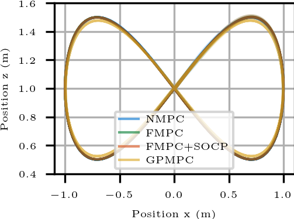
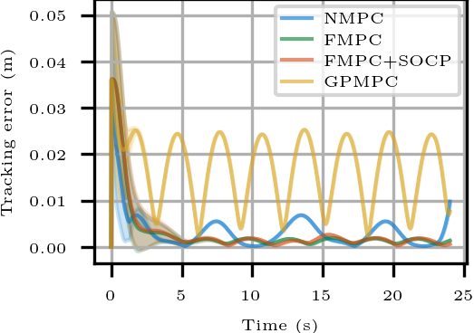
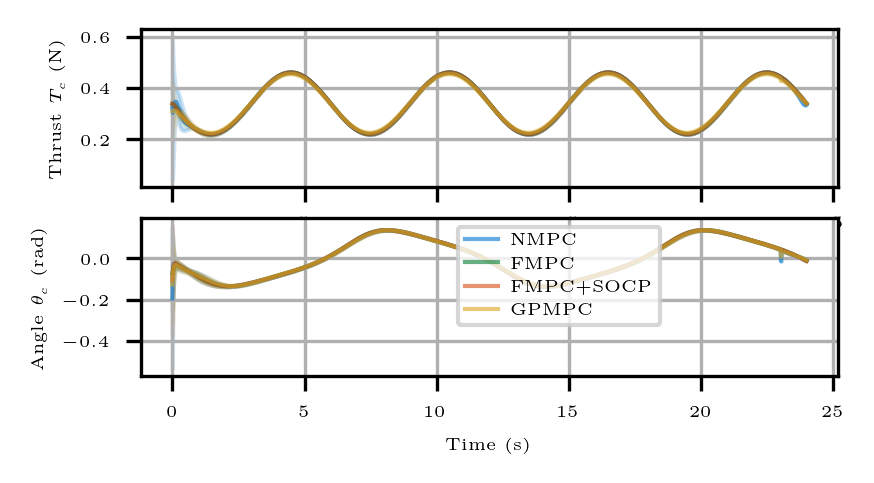
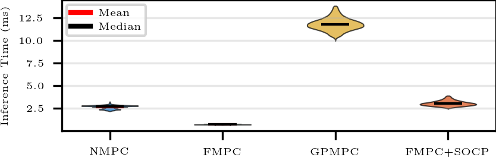
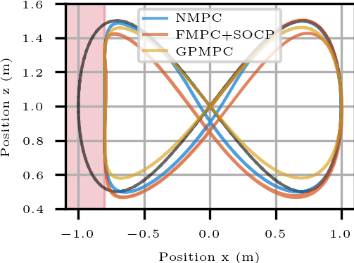
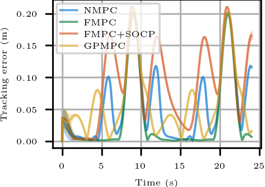
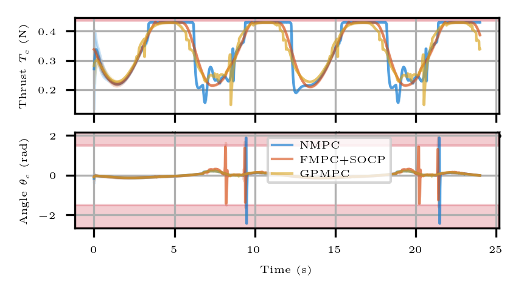
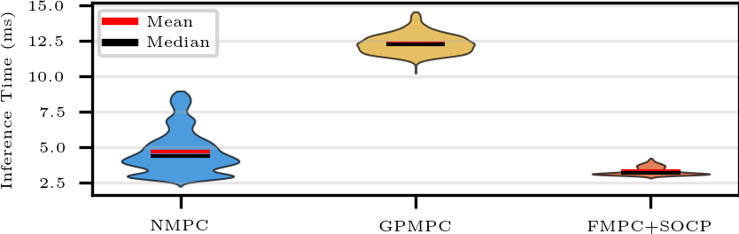

# Exploiting Differential Flatness for Efficient Learning-based Model Predictive Control Under Constraints
This repo contains the code to reproduce the experiments in the paper "Exploiting Differential Flatness for Efficient Learning-based Model Predictive Control Under Constraints".


Learning-based control techniques use data from past trajectories to control systems with uncertain dynamics. However, learning-based controllers are often computationally inefficient, limiting their practicality. To address this limitation, we propose a learning-based controller that exploits differential flatness, a property of many robotic systems. Recent research on using flatness for learning-based control either is limited in that it (i) ignores input constraints, (ii) applies only to single-input systems, or (iii) is tailored to specific platforms. In contrast, our approach uses a system extension and block-diagonal cost formulation to control general multi-input, nonlinear, affine systems. Furthermore, it satisfies input and half-space flat state constraints and guarantees probabilistic Lyapunov decrease using only two sequential convex optimizations. We show that our approach performs similarly to, but is multiple times more efficient than, a Gaussian process model predictive controller in simulated and real experimental quadrotor tracking tasks.

This code is based on [safe-control-gym](https://github.com/utiasDSL/safe-control-gym/). The GP implementation with affine kernel is based on [fmpc_socp](https://github.com/utiasDSL/fmpc_socp)

## Install on Ubuntu/macOS
For detailed instructions see the [safe-control-gym](https://github.com/utiasDSL/safe-control-gym/) README
### Clone repo 
```bash 
git clone https://github.com/utiasDSL/mimo_fmpc_socp.git
cd mimo_fmpc_socp
```

### (optional) Create a `conda` environment

Create and access a Python 3.12 environment using
[`conda`](https://docs.conda.io/projects/conda/en/latest/user-guide/install/index.html)

```bash
conda create -n safe python=3.12
conda activate safe
```

### Install
```bash
python3 -m pip install --upgrade pip
python3 -m pip install -e .
```
### Ensure that GPyTorch is version 1.13
```bash
 pip3 show gpytorch
 ```
 remove and reinstall version 1.13 if necessary
 ```bash
 pip3 uninstall gpytorch
 pip3 install gpytorch==1.13
 ```

### SOCP Solver Requirements

**CLARABEL Solver:**
The SOCP is solved using the [CLARABEL](https://github.com/oxfordcontrol/Clarabel.rs) solver. CLARABEL is an open-source interior-point conic solver that supports second-order cone constraints. Its installation is automatically performed, however, you may beed to install `rust` and `eigen` for code generation. Please see the `CVXPYgen` and `CLARABEL` installation instructions.

**CVXPYgen:**
We use [cvxpygen](https://github.com/cvxgrp/cvxpygen) for efficient code generation of CVXPY problems. This is installed automatically as part of the dependencies.

**MOSEK License:**
Alternatively, MOSEK can be used for solving the SOCP. As MOSEK is closed source, there `CVXPYgen` cannot perform c-code generation for it. For setting up the MOSEK license see the MOSEK [installation guide](https://docs.mosek.com/latest/install/installation.html). MOSEK is used to solve the Second Order Cone Program (SOCP) safety filter.

### MPC Solver Requirements

**ACADOS**:
The MPC solver used in our experiments is `ACADOS`. `ACADOS` is a very specialized and efficient open-source MPC solver. To install the `ACADOS` python interface, please follow these [instructions](https://docs.acados.org/python_interface/index.html). 

**CasADi**:
Alternatively, you may solve the MPC using `CasADi`'s `IPOPT` solver. This is significantly slower.

## To recreate the simulations in the paper

### Monte Carlo Experiments (Recommended)

To recreate the full Monte Carlo experiments from the paper with 30 trials each:

```bash
cd runs_paper/
./run_paper_experiments.sh
```

The experiment configurations are given in the `runs_paper/config_overrides_fast` and `runs_paper/config_overrides_constrained` directories for the unconstrained and constrained experiments.

This script runs both the unconstrained and constrained tracking tasks with randomized initial conditions. The experiments took approximately 20-30 minutes each to complete each (total ~1 hour) using an AMD® Ryzen 9 3900xt 12-core processor × 24.

**Results are saved to:**
- `runs_paper/monte_carlo_results/normal/<timestamp>` - Unconstrained tracking results
- `runs_paper/monte_carlo_results/constrained/<timestamp>` - Constrained tracking results

Each results directory contains:
- **Plots** (saved in timestamped subdirectories, e.g., `2025-01-15_14-30-00/`):
  - `position_distribution.png` - Mean position with 1 std shaded for all controllers vs. reference
  - `input_distribution.png` - Mean control inputs with 1 std for all controllers
  - `tracking_error_distriubiton.png` - Mean position tracking error over time with 1 std for all controllers
  - `timing_breakdown.png` - Violin plots of the computation time breakdown by controller component

- **Performance Metrics**: Timing comparisons and statistical metrics (mean RMSE, standard deviation, success rates) are displayed at the end of the run and saved to the `run.log` file in the results directory. The tables are given at the bottom of the files (which can be very long).

**Running experiments individually with Python:**

You can also run experiments individually with custom parameters:

```bash
cd runs_paper/

# Unconstrained tracking (30 trials)
python3 run_exp_paper_monte_carlo.py --mode normal --n_trials 30

# Constrained tracking (30 trials)
python3 run_exp_paper_monte_carlo.py --mode constrained --n_trials 30

# Run specific controllers only
python3 run_exp_paper_monte_carlo.py --mode normal --n_trials 30 --controllers fmpc fmpc_socp

# Run with GUI visualization (slower, useful for debugging)
python3 run_exp_paper_monte_carlo.py --mode normal --n_trials 2 --gui
```

Available controllers: `mpc` (NMPC), `fmpc` (FMPC), `fmpc_socp` (proposed approach), `gpmpc` (GPMPC baseline).


## Citing
TBD  once published. 

## Implementation details

### MPC Solvers

The MPC for all test cases is implemented using [CasADi](https://web.casadi.org) and [ACADOS](https://docs.acados.org/). Controllers can use either:
- **CasADi with IPOPT**: Slower, but easier to install. 
- **ACADOS**: Used for GPMPC and optionally for other controllers (configurable via `use_acados: true` in controller configs)

ACADOS generated code is stored in `generated_acados_c_code/` by default (automatically ignored by git).

### SOCP Safety Filter

The Second Order Cone Program (SOCP) for our proposed FMPC+SOCP approach is solved using [CVXPY](https://www.cvxpy.org/) with either:
- **CLARABEL** (recomended): Open-source SOCP solver that can be c-compiled with `CVXPYgen`
- **MOSEK**: Alternative commercial solver with academic licenses available

The solver choice is configurable in the SOCP filter implementation.

### Dynamics Simulation

The dynamics simulation uses the **symbolic model** of the 2D quadrotor. The safe-control-gym PyBullet physics simulation is **not used** for the paper experiments.

### SOCP Safety Filter Parameters

For the proposed FMPC+SOCP approach:
- **Extended input bounds**: (-10, -1.5) to (10, 1.5)
- **√β (stability uncertainty quantile)**: 2
- **Quantile in L_i (feedback linearization)**: 2
- **Quantile in state constraints**: 3
- **MPC horizon**: 50 timesteps
- **Control frequency**: 100 Hz

### Dynamic Extension

The thrust input T_c is replaced by its second derivative T_c_ddot using a double integrator model, enabling direct optimization over smooth thrust commands while maintaining input differentiability.

## GP Training

The repository includes pre-trained Gaussian Process models. If you need to retrain them:

### Training FMPC+SOCP GPs

To train the GPs used by the proposed FMPC+SOCP approach:

```bash
cd gp
python3 fgp_training_data_sim_ext.py
python3 fgp_training_data_aroundFig8.py
```

To train the GPs afterwards:
```bash
python3 training_flat_gps.py
```

**Note:** Adjust line 242 in `training_flat_gps.py` to train the first or second GP (the system uses two independent GPs for the two flat input dimensions).

### Training GPMPC GPs

To generate and train the Gaussian Process models for the GPMPC baseline controller:

```bash
cd gp
python3 generate_gpmpc_gps.py
```

This script:
1. Generates training data by running the quadrotor on the figure-8 trajectory
2. Trains two GP models (one for each control input dimension)
3. Saves the trained models to `gp/gpmpc_acados_TP/results/`

**Training Configuration:**
- Task config: `gp/config_overrides/quadrotor_2D_attitude_tracking.yaml`
- Algorithm config: `gp/config_overrides/gpmpc_acados_TP_training.yaml`

The GPMPC controller configs in `runs_paper/config_overrides_*/` will automatically reference the most recent trained models via the `gp_model_path` parameter.

### Visualizing and Analyzing Results

**Interactive Viewer:**

To browse and visualize Monte Carlo experiment results with a GUI:

```bash
cd runs_paper/
./launch_viewer.sh
```

This launches an interactive application that allows you to:
- Load any timestamped Monte Carlo run
- Select specific controllers and trials
- Plot individual state trajectories (x, ẋ, z, ż, θ, θ̇) and inputs (T_c, θ_c)
- View trial information and initial conditions
- Interactive matplotlib plots with zoom/pan/save capabilities

**Regenerating Plots:**

To regenerate plots from previously saved Monte Carlo results without re-running experiments:

```bash
cd runs_paper/
./regen_plots.sh
```

This script:
1. Prompts you to select a result directory (normal or constrained mode)
2. Lists available timestamped result sets
3. Regenerates all comparison plots (state trajectories, inputs, timing, etc.)
4. Useful for creating publication-quality figures with modified plotting parameters

### Hardware Experiment Results

To plot the hardware experiment results included in the paper:

```bash
cd runs_paper/
python3 plot_hardware_consistent.py
```

This script generates plots comparing the hardware experimental data for:
- **Unconstrained tracking**: Data from `hardware_data/unconstrained/`
- **Constrained tracking**: Data from `hardware_data/constrained/`

The plots show state trajectories, control inputs, and tracking performance from real quadrotor flight experiments, validating the simulation results.


### Simulation Figures:

**Unconstrained**:






**Constrained**:





