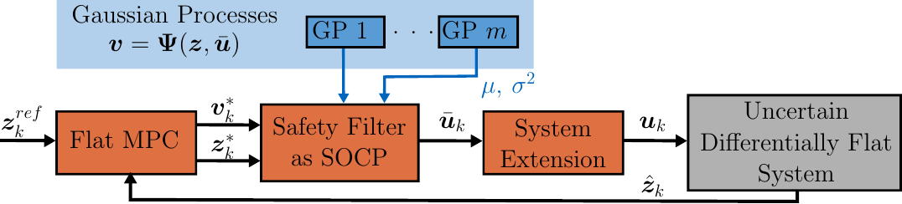

# Multi-input Second Order Cone Safety Filtering for Constrained Learning-based Flat Model Predictive Control
This repo contains the code to reproduce the experiments in the paper "Multi-input Second Order Cone Safety Filtering for Constrained Learning-based Flat Model Predictive Control".



Learning-based control techniques are used to control systems with uncertain dynamics by leveraging data from past trajectories to learn a system model. However, learning-based controllers are often computationally inefficient, limiting their use in practice. To address this limitation, we propose a learning-based controller that exploits differential flatness—a structural property of many useful systems—for the efficient control of general nonlinear affine multi-input differentially flat systems. Recent research on exploiting flatness for learning-based control either doesn’t  account for input constraints, is only formulated for single-input systems, or is specialized for a specific system (i.e., a quadrotor). In contrast, our approach uses a safety filter that guarantees probabilistic asymptotic stability, probabilistic flat state constraint satisfaction, and can account for constraints on the system input. Additionally, our proposed controller is composed of two sequential convex optimizations, enabling efficient control while relying solely on learned dynamics. Using a quadrotor simulation, we show that our approach achieves similar performance as a nonlinear model predictive controller that has perfect knowledge of the system dynamics, validating the functionality of our approach for learning-based control.

This code is based on [safe-control-gym](https://github.com/utiasDSL/safe-control-gym/). The GP implementation with affine kernel is based on [fmpc_socp](https://github.com/utiasDSL/fmpc_socp)

## Install on Ubuntu/macOS
For detailed instructions see the [safe-control-gym](https://github.com/utiasDSL/safe-control-gym/) README
### Clone repo 
```bash 
git clone https://github.com/utiasDSL/mimo_fmpc_socp.git
cd mimo_fmpc_socp
```

### (optional) Create a `conda` environment

Create and access a Python 3.10 environment using
[`conda`](https://docs.conda.io/projects/conda/en/latest/user-guide/install/index.html)

```bash
conda create -n safe python=3.10
conda activate safe
```

### Install
```bash
python -m pip install --upgrade pip
python -m pip install -e .
```
### Ensure that GPyTorch is version 1.13
```bash
 pip show gpytorch
 ```
 remove and reinstall version 1.13 if necessary
 ```bash
 pip uninstall gpytorch
 pip install gpytorch==1.13
 ```
### MOSEK license
For setting up the MOSEK license see the MOSEK [installation guide](https://docs.mosek.com/latest/install/installation.html)

## To recreate the simulations in the paper
To recreate the tracking task with no state and input constraints
```bash 
cd runs_paper/
python3 run_exp_paper.py
```
To recreate the tracking task with state constraint and input constraint
```bash 
cd runs_paper/
python3 run_exp_paper.py --mode constrained
```
Both scripts run for a couple of minutes and then display the plots shown in the paper. 

## Citing
TBD  once published. 

## Implementation details
The MPC for all test cases is implemented using [CasADi](https://web.casadi.org). We solve the resulting optimal control problem with *ipopt* in CasADi for all controllers. 

The Second Order Cone Program (SOCP) for our proposed approach is solved using [MOSEK](https://www.mosek.com/). 

The dynamics simulation is done using the symbolic model of the 2d quadrotor. The safe-control-gym PyBullet physics simulation is not used. 

We give the reference to FMPC and our proposed approach as a full flat state reference and to NMPC as a position and velocity reference. 

The cost function matrices of FMPC and our proposed approach are: 
Q = diag(50, 0.001, 0.1, 0.001, 50 , 0.001, 0.1, 0.001), 
R = diag(1.0e-6, 1.0e-6)

The cost function matrices of NMPC are: 
Q = diag(5, 0.1, 5, 0.1, 0.1, 0.1), 
R = diag(0.1, 0.1)

Other parameters are set to:
- lower constraint on extended input (-10, -1.5)
- upper constraint on extended input (10, 1.5)
- sqrt(beta): 2
- quantile in L_i: 2
- quantile in State Constraint: 3

## GP Training
To get the GP training data
```bash
cd gp
python3 fgp_training_data_sim_ext.py 
python3 fgp_training_data_aroundFig8.py 
```
To train the GPs afterwards
```bash
python3 training_flat_gps.py 
```
adjust line 242 to train the first or second GP